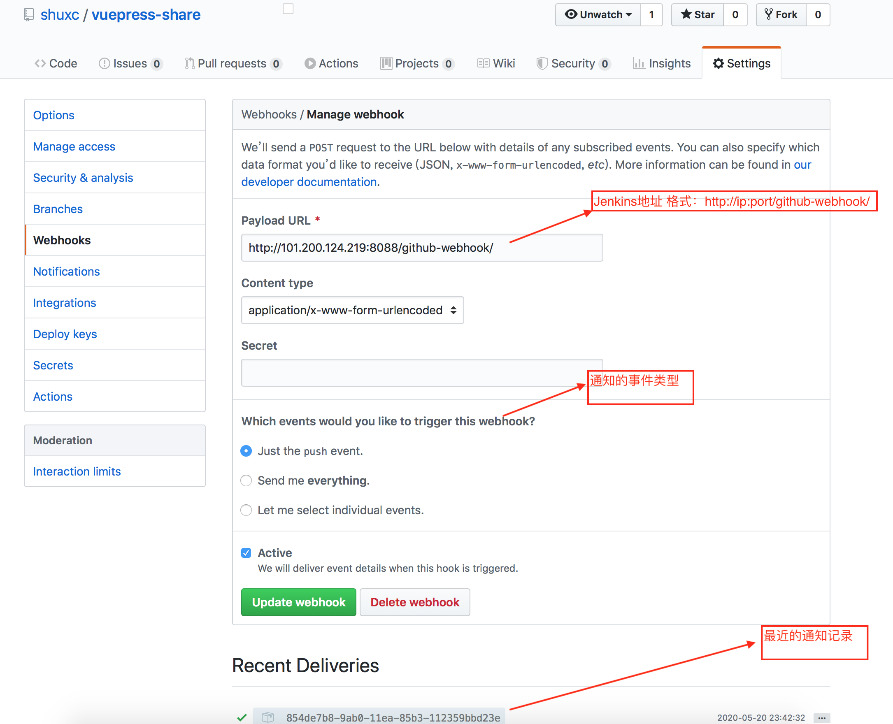
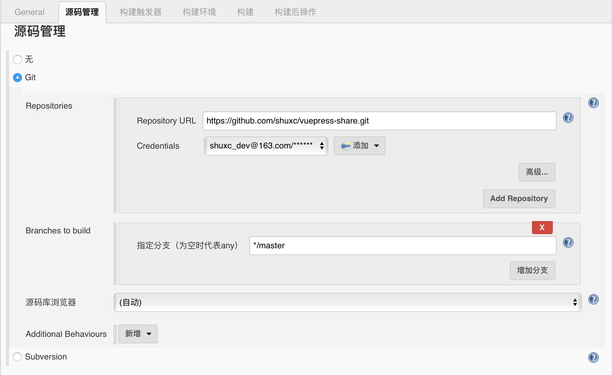
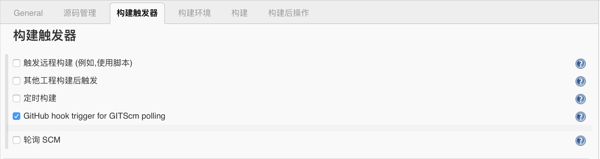
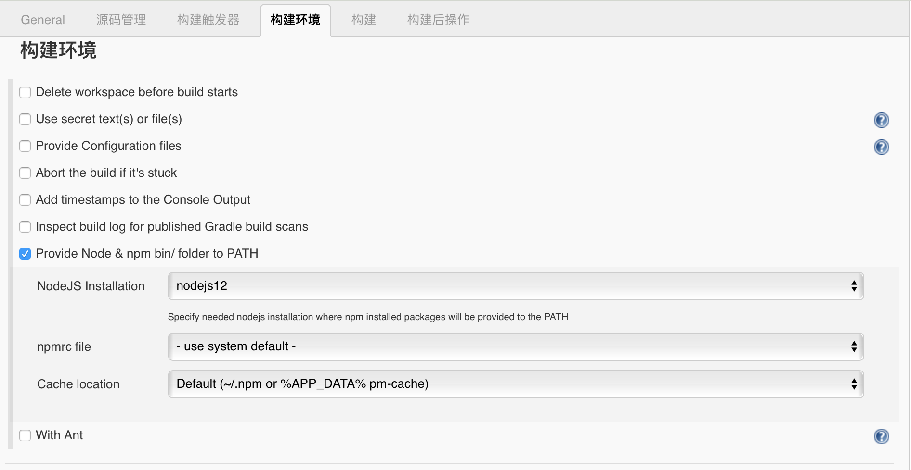
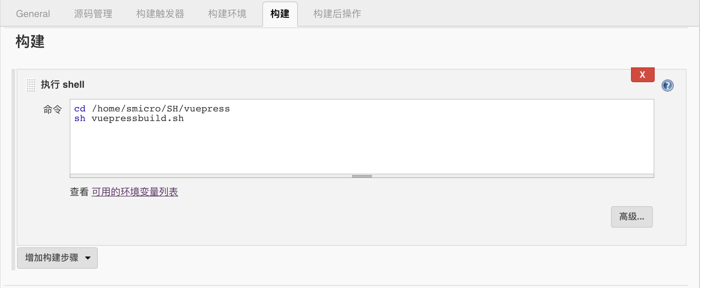
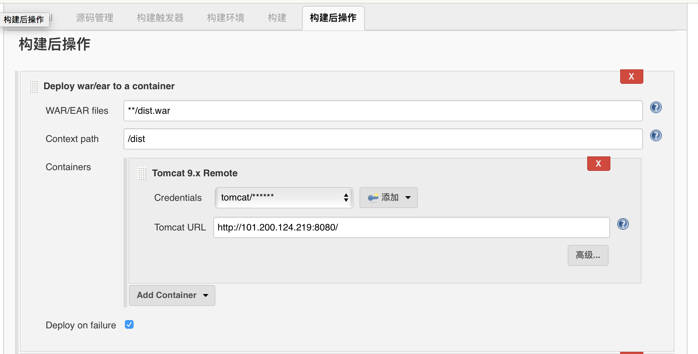

# 自动编译部署
*本地代码提交至GitHub上，Jenkins自动编译最新代码并部署*
***
实现工具列表
+ [GitHub][1]
+ [Tomcat][2]
+ [Jenkins][3]

实现大概逻辑
+ 本地代码提交至GitHub，GitHub将提交代码的event事件通知Jenkins
+ Jenkins接收到通知，触发构建流程
+ Jenkins编译后，将生成的静态页面打包成war文件，部署在tomcat容器中
+ Jenkins将编译部署结果邮件通知相关人员
***
## GitHub
*GitHub支持仓库代码变动时，发送通知给相关应用*

实现操作
+ 在GitHub上创建仓库，在其对应的`Settings`菜单下选择`Webhooks`，按如图所示设置Jenkins通知地址


## Tomcat
*Tomcat用于部署web应用，Jenkins可以通过相关插件将war包部署在Tomcat上*

实现操作
+ 下载安装Tomcat
+ 添加账户和权限，该账户具有管理Tomcat部署等相关权限
 Tomcat中`tomcat-users.xml`添加相关账号和权限
 ```XML doc
    <role rolename="manager"/>　  
    <role rolename="manager-gui"/>　  
    <role rolename="admin"/>　  
    <role rolename="admin-gui"/>　  
    <role rolename="manager-script"/>  
    <user username="tomcat" password="*****" roles="admin-gui,admin,manager-gui,manager,manager-script"/> 
 ```
::: tip 提示
1. 管理Tomcat部署只需要`manager-gui`，`manager-script`权限即可
2. Tomcat9以上可能默认不支持非本地IP访问Tomcat管理页面，需修改其相关配置(百度)
:::

## Jenkins 
*[Jenkins][3]是开源CI&CD软件领导者， 提供超过1000个插件来支持构建、部署、自动化， 满足任何项目的需要。
本次编译的VuepPress需要安装`NodeJS`插件，部署时需要操作Tomcat，故还需要安装`Deploy to container Plugin`插件*

实现操作
+ 下载安装Jenkins
+ 在`系统管理`->`插件管理`中，安装`NodeJS`,`Deploy to container Plugin`插件
+ 在`系统管理`->`全局工具配置`中，设置`NodeJS`信息，编译构建时会用到
+ 在`新建任务`->`构建一个自由风格的软件项目`中,
配置相关信息 `General`->`源码管理`->`构建触发器`->`构建环境`->`构建环境`->`构建`->`构建后操作`
    + `General`略过 
    + `源码管理`使用git仓库
     
    + `构建触发器`
    
    + `构建环境`配置NodeJS信息
    
    + `构建`运行相关脚本
    
    `vuepressbuild.sh`
     ```shell script
        cd /home/smicro/.jenkins/workspace/VuePress-Share
        echo &pwd
        yarn add -D vuepress
        echo 'yarn add -D vuepress success'
        yarn docs:build
        echo 'yarn docs:build success'
        cd /home/smicro/.jenkins/workspace/VuePress-Share/.vuepress/dist
        echo &pwd
        jar -cvf dist.war ./*
        echo 'create war success' 
     ```
    ::: tip 提示
    1. Jenkins下载的工程在/home/smicro/.jenkins/workspace/ 下
    2. `jar -cvf dist.war ./*` 将静态文件打成war包
    :::
    + `构建后操作` 将war部署在Tomcat上
    
    
    ::: tip 提示
    1. `WAR/EAR files` You can also specify Ant-style GLOBs（如图配置可正确获取war包）
    2. 可继续添加构建后的操作，如发送邮件
    :::
    
[1]: https://github.com "GitHub"
[2]: https://tomcat.apache.org "Tomcat"
[3]: https://www.jenkins.io "Jenkins"